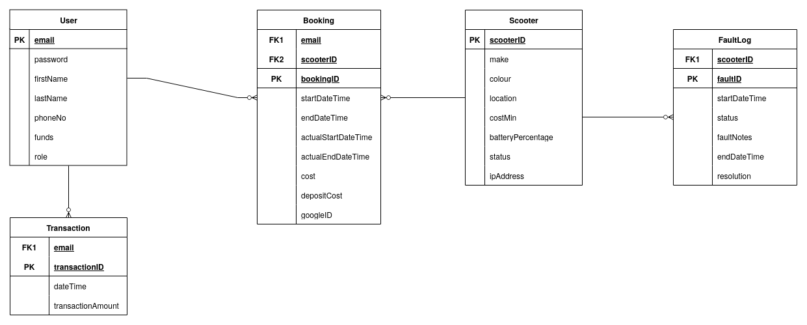
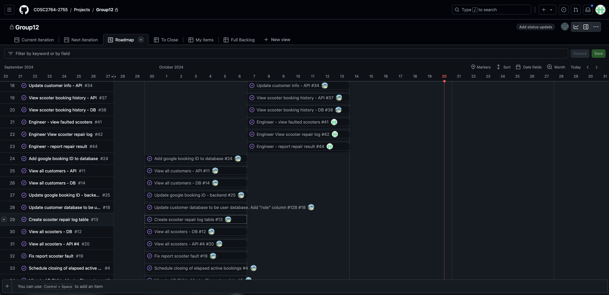
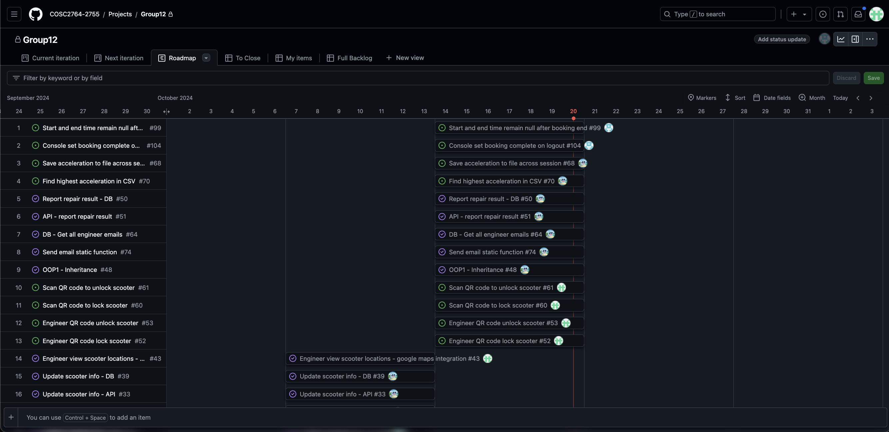

# COSC2674 - Programming IoT Group Assignment Part 2

## Table of Contents

- [Group 12 Contributors](#group-12-contributors)
- [Project Overview](#project-overview)
- [Running the Project](#running-the-project)
  - [Prerequisites](#prerequisits)
  - [Execution](#execution)
- [Usage](#usage)
- [Unit Testing](#unit-testing)
- [Project Management](#project-management)

## Group 12 Contributors

| Author        | Student Number |
| ------------- | -------------- |
| Aiden Contini | S3780445       |
| Jaim Zacharia | S3855148       |
| Ben Hodder    | S4006398       |

## Project Overview

This project is a Scooter Share Platform, designed for a scooter-sharing company. The platform provides an automated system where customers can find, book, use, and return scooters through an intuitive web-based application. Additionally, administrators and engineers can manage and maintain backend operations. The system integrates multiple technologies and frameworks such as Flask, Object-Oriented Python, Google Calendar API, PostgreSQL, and Google Cloud.

### Main Functionalities:

#### Customer Portal:

- Registration and Login: Customers can register and log in using their credentials. The platform supports QR codes as an alternative login option.
- Book and Unlock Scooters: Customers can book and unlock scooters, with bookings integrated into Google Calendar.
- View Scooter Availability: Detailed information on available scooters, including make, color, location, remaining power, and cost per time.
- Manage Account Balance: View available funds and top up the account.
- View Usage History: Track previous scooter usage.
- Report Scooter Issues: Report problems encountered with scooters.

#### Booking Management:

- Google Calendar Integration: All bookings can be added to the customer’s Google Calendar, and customers can cancel or modify bookings.
- Scooter Availability and Locking: Scooters are unlocked and locked via credentials or by scanning QR codes. Booking status is updated accordingly, and bills are generated upon return of the scooter.

#### Scooter Operations:

- Unlock and Lock Scooters: Scooters can be unlocked using either user credentials or QR code scanning. Only the customer who booked the scooter can unlock it.
- Automatic Billing: Upon scooter return, a bill is automatically generated and the account charged based on usage.

#### Admin Portal:

- Customer and Scooter Management: Admins can view and manage customer details, including first name, last name, email, phone number, and account balance. They can also manage scooter details and availability, reporting any issues.
- View History: Admins can view detailed usage and booking history for scooters.
- Data Visualization: Generate reports on scooter usage, with visualizations on a daily and weekly basis.

#### Engineer Portal:

- Scooter Repair: Engineers receive email notifications for scooter issues and can view detailed information, including location, make, and remaining power. They can unlock scooters for repairs via QR code scanning.
- Report Repairs: Engineers can log repair results directly into the system, updating the scooter’s status in the cloud database.

### Cloud Database Schema



### System Enhancements Part 1

#### Find My Scooter

If a user cannot locate a specific scooter, they may use a "Find My Scooter" button from the web UI. This will send a command from the UI to the Backend and then to the Agent-Pi Console (Via TCP Sockets). The scooter will then perform a "Find My" routine, playing a sound and flashing the LEDs on the Sense HAT.

#### Booking Deposits

To ensure scooter bookings are not wasted, a minimum deposit equal to the minimum booking duration (10 minutes) will be automatically deducted from a customer's funds. Upon completion of the booking, this deposit is then accounted for in the overall booking price and subtracted from the final total.

### System Enhancements Part 2

#### Session Performance Overview

Upon logging out and completing a scooter booking, users will now receive feedback on their session's performance. Specifically, the console will display the top acceleration achieved during the ride. This data is gathered from the scooter's onboard sensors and calculated in real-time.

#### Password Reset Feature

To improve user convenience, a new "Forgot My Password" feature has been introduced. If customers/engineers forget their login credentials, they can easily reset their password by clicking the "Forgot My Password" button on the login page. This triggers an email to be sent to the registered email address with a password reset link. Users can then follow the link to create a new password.

### Object Oriented Patterns Part 1

#### Pattern 1: Inheritance

Inheritance is used specifically in the `db_driver` package within the `database_handler` project. By inheriting from BaseHandler, the individual handler classes can reuse code, particularly the database driver initialization and logging setup. This avoids code duplication, making the codebase cleaner and easier to maintain. For example, any modifications or enhancements made to the database handling or logging mechanisms in BaseHandler will automatically be reflected in BookingHandler, thus enhancing consistency across the codebase. By abstracting the functionalities for setting up a database connection and configuring logging into the base class, it allows derived classes to focus on their specific functionalities, like managing their own specific tables within the database, without having to worry about the underlying database connection details. This benefits the maintainability of the code as it allows the developer to simply adjust the functions within the derived classes when new SQL queries are to be added to the project.

#### Pattern 2: Singleton

Singleton was used for most of the handlers in the project, this was because of only wanting one instance of the object to exist within the program. If there was more then one instance in the project there could be issues with them fighting over control, for example if there is multiple instance of the sense_handler they could both try to display to the leds at the same time and there wouldn't be a way to tell what is meant to be displayed. With there only being one instance of the object there will not be any issues like this and the screen will display what is meant to be displayed.

#### Pattern 3: State

The state pattern was used specifically in the scooter_handler class to manage the various states a scooter can transition through (Available, Booked, In Use, Needs Repairs). This pattern allows the code to encapsulate state-specific behaviour within different state classes, making the scooter_handler class more maintainable and easier to extend. Each state is represented by a subclass of ScooterState, and the scooter's current state determines its behaviour, such as whether a user can log in or report a fault. By using the state pattern, different behaviours for each state are kept in separate classes, ensuring that changes or additions to state-specific logic do not affect other states. This modularity reduces complexity in the main scooter_handler and makes it easier to extend the functionality.

### Object Oriented Patterns Part 2

#### Pattern 1: Inheritance

Inheritance is used extensively within the User management module of the scooter-sharing platform. By creating specific classes such as Admin, Customer, and Engineer that inherit from the base User class, the project avoids redundant code and improves maintainability. The base User class defines common attributes and methods like email, password, first_name, last_name, phone_no, and funds, as well as methods for converting objects to and from dictionaries.

This inheritance structure allows the individual roles (admin, customer, engineer) to reuse the core logic of the User class while specializing their behavior when necessary. In this way, the User base class ensures consistency across different user roles while simplifying the process of modifying or expanding user functionality. Any changes to shared attributes or methods in User will automatically propagate to Admin, Customer, and Engineer, enhancing the scalability and maintainability of the system.

#### Pattern 2: State

In the `scooter_handler` class, the state pattern is used to manage the different states a scooter can transition through, such as Available, Booked, In Use, and Needs Repairs. By applying this pattern, state-specific behavior is encapsulated within distinct state classes, making the `scooter_handler` class more modular and maintainable. Each state is represented as a subclass of `ScooterState`, and the scooter's current state determines its actions, like whether a user can log in or report a fault. This approach keeps the behavior for each state isolated in its respective class, ensuring that changes or additions to one state’s logic don’t interfere with others. As a result, the code becomes less complex and easier to extend when new states or behaviors are introduced.

## Running the Project

### Prerequisites

- 2x individual host systems must be used
  - One to act as the Master-Pi and the second the Agent-Pi
- Programs `master-pi/backend`, `master-pi/database_handler` and `master-pi/frontend` must be run from the Master-Pi host.
- Programs `agent-pi/frontend` and `agent-pi/console` must be run from the Agent-Pi host.
- All credentials required to interact with the cloud database and the Google Cloud API are contained within this repository.
- The Sense-Hat library must be installed on the agent Pi using `sudo apt-get install sense-hat`

### Execution

#### **Master Pi**

1. Ensure the current working directory is the `master-pi` directory.
2. Run the shell script `./prepare_venv.sh`. This script will update the `requirements.txt` file for each of the two projects and install these into a virtual environment `venv`.
3. In the current terminal, activate the virtual environment using the command `source venv/bin/activate`.
4. Launch the database handler using the command `python database_handler`. This must be run from the `master-pi` directory.
5. In a separate terminal, navigate to the `master-pi` directory and again run `source venv/bin/activate`.
6. Launch the backend using the command `python backend`. This must be run from the `master-pi` directory.
7. In a separate terminal, navigate to the `master-pi` directory and again run `source venv/bin/activate`.
8. Launch the frontend using the command `python frontend`. This This must be run from the `master-pi` directory.

#### **Agent Pi**

1. Ensure the current working directory is the `agent-pi` directory.
2. Run the shell script `./prepare_venv.sh`. This script will update the `requirements.txt` file for each of the two projects and install these into a virtual environment `venv`.
3. Update the file `agent-pi/resources.json` with the IP address of the Master-Pi. This file may also be used to change the Scooter ID.
4. Launch the console using the command `python console`. This must be run from the `agent-pi` directory. The venv should **not** be used.
5. In a separate terminal, navigate to the `agent-pi` directory and run `source venv/bin/activate`.
6. Launch the Flask UI using the command `python frontend`. This must be run from the `agent-pi` directory.

#### **Cleanup**

To deactivate the virtual environment, the command `deactivate` should be run from within the terminal.

## Usage

### **Master-Pi**

- The database handler API is hosted on TCP **Port 8080**.
  - [API Documentation](master-pi/database_handler/api_documentation/API_Documentation.md)
- The Frontend and Agent Pi interact with the Backend via TCP Sockets on **Port 6500**.
  - [Sockets Documentation](master-pi/backend/resources/socket_commands.md)
- The Master PI frontend application is hosted on **PORT 8000**.
  - This should be accessed through `http://localhost:8000` (if on hosted Pi) or `http://master-pi-ip:8000` (if different machine, where the master-pi-ip is the IP Address of the master-pi hosting the frontend) on a web browser

### **Agent-PI**

- [Frontend Documentation](agent-pi/frontend/README.md)
- The frontend application is hosted on **PORT 8000**.
  - This should be accessed through `http://localhost:8000` (if on hosted Pi) or `http://agent-pi-ip:8000` (if different machine, where the _agent-pi-ip_ is the IP Address of the agent-pi hosting the frontend) on a web browser

### Test Accounts

Below are customer test accounts available for use for the application. Otherwise, feel free to register your own account:

| Email                      | Password              |
| -------------------------- | --------------------- |
| alice.smith@example.com    | password123           |
| bob.jones@example.com      | securepass            |
| charlie.brown@example.com  | charlie123            |
| group12.cosc2674@gmail.com | Mayday-Bunny-Isotope8 |

For logging into the admin panel use this account, the default admin account doesn't use an email and shouldn't be removed as more users can be made an admin using this accont:

| Email | Password |
| ----- | -------- |
| admin | admin    |

For logging into the engineer panel, user this account or create a new account with the domain `@engineer.com`:

| Email             | Password |
| ----------------- | -------- |
| tony@engineer.com | ironman  |

To access the Google Calander and email, log into Google using the following username and password:

| Email                      | Password              |
| -------------------------- | --------------------- |
| group12.cosc2674@gmail.com | Mayday-Bunny-Isotope8 |

## Unit Testing

Unit testing was done for this project using GitHub continuous integration [configuration.yaml](.github/workflows/python-tests.yml). The CI would run on pull request and merge into branches both `dev` and `main`. The workflow runs are visible on the [Github Actions](https://github.com/COSC2764-2755/group-assignment-part-1-group12/actions) page.

To run all unit tests for all four projects at once, the included bash script can be run from the project root directory.

```bash
$ ./run_all_unit_tests.sh
```

Unit tests can be run from within each of the four individual project directories using the command below.

```bash
$ python -m unittest discover
```

## Project Management

The group made heavy use of the GitHub projects feature to allocate tasks, due dates scrums. The Agile method was used throughout the project, totalling 3 one-week iterations (scrums).

- The full project roadmap is available here: [Roadmap](https://github.com/orgs/COSC2764-2755/projects/11/views/4)
- Some screenshots of the Roadmap are available below.




## Scooter Statuses

- [Documentation](agent-pi/console/docs/ScooterStatus.md)

## Backend Socket Commands

- [Documentation](master-pi/backend/resources/socket_commands.md)
